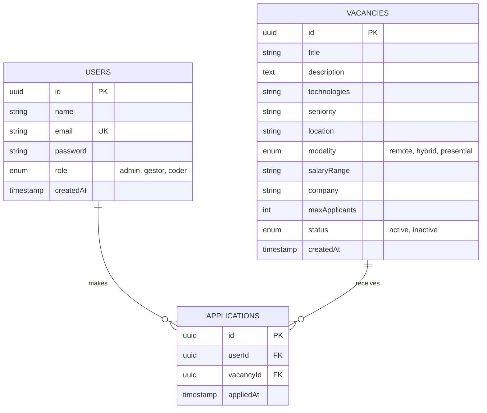

# Modelo Relacional y Base de Datos

En proyectos modernos con **NestJS y TypeORM**, no sueles escribir archivos `.sql` a mano para crear la base de datos (como `CREATE TABLE...`), porque el código lo hace por ti automáticamente (ORM).

Sin embargo, para documentación, **SÍ** es muy útil tener un diagrama.

## Diagrama Entidad-Relación (ERD)

Aquí tienes el diagrama exacto de tu sistema actual:

## ¿Es necesario el archivo .sql?
**No estrictamente.**
Tu aplicación está configurada con `synchronize: true` (en `app.module.ts`), lo que significa que al arrancar, el servidor:
1.  Lee tus archivos `.entity.ts`.
2.  Compara con la base de datos.
3.  Crea o actualiza las tablas automáticamente.

Si un profesor o cliente te pide el SQL, puedes generarlo exportando la base de datos, pero para desarrollar y desplegar **no lo necesitas**.
